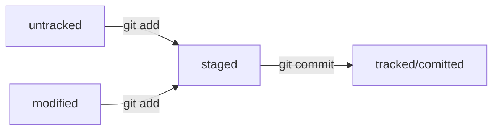

# Краткая памятка по работе с Git 

## Шпаргалка. Базовые команды в консоли

### Навигация

- pwd (от англ. print working directory, «показать рабочую папку») — покажи, в какой я папке;
- ls (от англ. list directory contents, «отобразить содержимое директории») — покажи файлы и папки в текущей папке;
- ls -a — покажи также скрытые файлы и папки, названия которых начинаются с символа .;
- cd first-project (от англ. change directory, «сменить директорию») — перейди в папку first-project;
- cd first-project/html — перейди в папку html, которая находится в папке first-project;
- cd .. — перейди на уровень выше, в родительскую папку;
- cd ~ — перейди в домашнюю директорию (/Users/Username);
- cd / — перейди в корневую директорию.

### Работа с файлами и папками

**Создание**
- touch index.html (англ. touch, «коснуться») — создай файл index.html в текущей папке;
- touch index.html style.css script.js — если нужно создать сразу несколько файлов, можно напечатать их имена в одну строку через пробел;
- mkdir second-project (от англ. make directory, «создать директорию») — создай папку с именем second-project в текущей папке.

**Копирование и перемещение**
- cp file.txt ~/my-dir (от англ. copy, «копировать») — скопируй файл в другое место;
- mv file.txt ~/my-dir (от англ. move, «переместить») — перемести файл или папку в другое место.

**Чтение**
- cat file.txt (от англ. concatenate and print, «объединить и распечатать») — распечатай содержимое текстового файла file.txt.

**Удаление**
- rm about.html (от англ. remove, «удалить») — удали файл about.html;
- rmdir images (от англ. remove directory, «удалить директорию») — удали папку images;
- rm -r second-project (от англ. remove, «удалить» + recursive, «рекурсивный») — удали папку second-project и всё, что она содержит.

### Полезные возможности

- Команды необязательно печатать и выполнять по очереди. Можно указать их списком — разделить двумя амперсандами (&&).
- У консоли есть собственная память — буфер с несколькими последними командами. По ним можно перемещаться с помощью клавиш со стрелками вверх (↑) и вниз (↓).
- Чтобы не вводить название файла или папки полностью, можно набрать первые символы имени и дважды нажать Tab. Если файл или папка есть в текущей директории, командная строка допишет путь сама.  
Например, вы находитесь в папке dev. Начните вводить cd first и дважды нажмите Tab. Если папка first-project есть внутри dev, командная строка автоматически подставит её имя. Останется только нажать Enter.

## Шпаргалка 2. Начало работы с Git

### Инициализация репозитория

- git init (от англ. initialize, «инициализировать») — инициализируй репозиторий.

### Синхронизация локального и удалённого репозиториев

- git remote add origin https://github.com/YandexPracticum/first-project.git (от англ. remote, «удалённый» + add, «добавить») — привяжи локальный репозиторий к удалённому с URL https://github.com/YandexPracticum/first-project.git;
- git remote -v (от англ. verbose, «подробный») — проверь, что репозитории действительно связались;
- git push -u origin main (от англ. push, «толкать») — в первый раз загрузи все коммиты из локального репозитория в удалённый с названием origin.
> 💡 Ваша ветка может называться master, а не main. Подправьте команду, если это необходимо.
- git push (от англ. push, «толкать») — загрузи коммиты в удалённый репозиторий после того, как он был привязан с помощью флага -u.

### Подготовка файла к коммиту

- git add todo.txt (от англ. add, «добавить») — подготовь файл todo.txt к коммиту;
- git add --all (от англ. add, «добавить» + all, «всё») — подготовь к коммиту сразу все файлы, в которых были изменения, и все новые файлы;
- git add . — подготовь к коммиту текущую папку и все файлы в ней.

### Создание и публикация коммита

- git commit -m "Комментарий к коммиту." (от англ. commit, «совершать», фиксировать» + message, «сообщение») — сделай коммит и оставь комментарий, чтобы было проще понять, какие изменения сделаны;
- git push (от англ. push, «толкать») — добавь изменения в удалённый репозиторий.

### Просмотр информации о коммитах

- git log (от англ. log, «журнал [записей]») — выведи подробную историю коммитов;
- git log --oneline (от англ. log, «журнал [записей]» + oneline, «одной строкой») — покажи краткую информацию о коммитах: сокращённый хеш и сообщение.

### Просмотр состояния файлов

- git status (от англ. status, «статус», «состояние») — покажи текущее состояние репозитория.

### Добавление изменений в последний коммит

- git commit --amend --no-edit (от англ. amend, «исправить») — добавь изменения к последнему коммиту и оставь сообщение прежним;
- git commit --amend -m "Новое сообщение" — измени сообщение к последнему коммиту на Новое сообщение.
>💡 Выйти из редактора Vim: нажать Esc, ввести :qa!, нажать Enter.

### «Откат» файлов и коммитов

- git restore --staged hello.txt (от англ. restore, «восстановить») — переведи файл hello.txt из состояния staged обратно в untracked или modified;
- git restore hello.txt — верни файл hello.txt к последней версии, которая была сохранена через git commit или git add;
- git reset --hard b576d89 (от англ. reset, «сброс», «обнуление» + hard, «суровый») — удали все незакоммиченные изменения из staging и «рабочей зоны» вплоть до указанного коммита.

### Просмотр изменений

- git diff (от англ. difference, «отличие», «разница») — покажи изменения в «рабочей зоне», то есть в modified-файлах;
- git diff a9928ab 11bada1 — выведи разницу между двумя коммитами;
- git diff --staged — покажи изменения, которые добавлены в staged-файлах.

# Подробно о работе с Git.

## Создаем локальный репозиторий

### Шаг 1. Устанавливаем Git 

> Чтобы проверить установлен ли у вас Git, необходимо запустить команду: $ git version

1. На Windows Git есть по умолчанию, на macOS, если его нет, чтобы установить Git нужно запустить команду: 

```
$ /usr/bin/git
```

2. Чтобы участникам проекта было понятно, кто и какие изменения вносил, нужно представиться и указать имя пользователя и адрес электронной почты. Сделать это можно с помощью команды git config с ключом --global (сработает везде, в какой директории вы бы не находились). 

```
$ git config --global user.name "User Namovich" 
# имя или ник нужно написать латиницей и в кавычках

$ git config --global user.email username@yandex.ru
# здесь нужно указать свой настоящий email
```

3. Все глобальные настройки Git хранит в файле .gitconfig в домашней директории. Команда запишет в этот файл указанные имя и почту. Чтобы убедиться в этом, можно вызвать команду для чтения файлов. Другой способ проверки — вывести содержимое файла конфигурации Git той же командой git config с флагом --list (англ. «список»). 

```
$ cat ~/.gitconfig # Убедитесь, что данные сохранились, с помощью одной из двух команд.
$ git config --list
```

### Шаг 2. Создаем локальный репозиторий

1. Для его создания нам необходимо **создать папку**, в которой будет храниться наш репозиторий, перейти в нее и **запустить инициализацию**.

Пример кода:

```
$ mkdir my_project # Вместо my_project может быть любое название Вашей папки
$ cd my_project
$ git init
```

2. Для того, чтобы проверить состояние репозитория запустите команду: 

```
$ git status
```

#### Если вы случайно сделали Git-репозиторием не ту папку, её можно «разгитить». 

Для этого нужно удалить скрытую подпапку .git.

```
$ cd <папка с репозиторием> # перешли в папку

$ rm -rf .git # удалили подпапку .git
```

### Шаг 3. Добавляем файлы в репозиторий

Как только мы создали файлы в папке, в которой инициализирован наш репозиторий, мы можем подготовить файлы к сохранению - git add

```
$ git add --all # подготовили к сохранению все файлы в репозитории
$ git status # проверили статус
```
> Добавлять файлы можно и по одному, без ключа --all, а вписывая имя файла. С помощью команды "git add ." можно добавить в репозиторий текущую папку со всеми файлами. 

### Шаг 4. Делаем первый коммит

Сделать коммит можно командой git commit c ключом -m (от англ. message — «сообщение»), который присваивает коммиту комментарий. Выполните его в папке репозитория.

```
$ git commit -m 'Мой первый коммит!' # Впишите в кавычки релевантный комментарий, который отображает суть изменений
```

__Сначала команда git add сообщает Git, какие именно файлы нужно сохранить и какую их версию. Затем с помощью команды git commit происходит само сохранение.__

> Посмотреть историю коммитов можно с командой - git log

## Создаем удаленный репозиторий и синхронизируемся

### Шаг 1. Инструкция по созданию репозитория на GitHub

0. Зарегистрируйтесь на GitHub.

1. Зайдите в свой профиль по ссылке https://github.com/username, где username — имя, которое вы указали при регистрации.

2. Создайте репозиторий. Для этого перейдите на вкладку Repositories (англ. «репозитории»), а затем нажмите на зелёную кнопку New (англ. «новый») справа.

3. Открылось окно создания нового репозитория. Назовите его my_project. Название удалённого репозитория необязательно должно совпадать с именем папки проекта у вас на компьютере. Но чтобы не путаться, будем называть их одинаково.

4. Другие поля вам пока не понадобятся. Смело нажимайте на зелёную кнопку Create repository (англ. «создать репозиторий») внизу.

### Шаг 2. Генерируем SSH-ключ. 

Для того, чтобы связать удалённый репозиторий с локальным, который уже есть на вашем компьютере. GitHub предоставляет для этого инструкцию (пункт …or push an existing repository from the command line).  
Но прежде, чтобы упростить работу с GitHub и сделать её более безопасной, вы научитесь генерировать SSH-ключи (от англ. Secure Shell — «безопасная оболочка»). Об этом в следующем уроке.

> Один из наиболее распространённых сетевых протоколов — SSH (от англ. Secure Shell Protocol). Он обеспечивает безопасный обмен данными в сети. С помощью этого протокола можно получать данные с удалённого компьютера или отправлять их на него. Трафик шифруется, поэтому протокол безопасен.

1. Прежде чем генерировать SSH-ключи, убедитесь, что у вас их ещё нет. По умолчанию директория с SSH-ключами находится в домашней директории пользователя. Перейдите в неё. Обычно SSH-ключи находятся в директории .ssh/. Проверить наличие этой директории и файлов в ней можно с помощью следующей команды.

```
$ cd ~ # перешли в домашнюю директорию

$ ls -la .ssh/ # вывели список созданных ключей
```

Если папка пустая или её нет, всё в порядке. 

2. Для генерации SSH-пары можно использовать программу ssh-keygen. Откройте терминал и введите следующую команду.

```
$ ssh-keygen -t ed25519 -C "электронная почта, к которой привязан ваш аккаунт на GitHub"
```

Если вы видите сообщение об ошибке, то, скорее всего, ваша система не поддерживает алгоритм шифрования ed25519. Ничего страшного: используйте другой алгоритм.

```
$ ssh-keygen -t rsa -b 4096 -C "электронная почта, к которой привязан ваш аккаунт на GitHub"
```

После ввода отобразится такое сообщение: 

```
"> Generating public/private rsa key pair. # сгенерированы публичный и приватный ключи"
```

3. Укажите место хранения ключей. Простой вариант — сделать домашний каталог пользователя путём по умолчанию. Для этого нажмите Enter.

Программа запросит кодовую фразу (англ. passphrase) для доступа к SSH-ключу. Вы можете оставить поле пустым. Для этого нажмите Enter, а затем ещё раз Enter для подтверждения.

4. Готово! Теперь осталось проверить, что ключи действительно сгенерировались. Для этого вызовите эту команду.

```
$ ls -a ~/.ssh
```

На экране должны появиться два файла — один с расширением .pub, другой — без. Файл в .pub — публичный, им можно делиться с веб-сайтами или коллегами. Файл без расширения .pub — приватный. Ни в коем случае не передавайте его никому! 

### Шаг 3. Привязываем SSH-ключ к GitHub

1. Инструкция по связыванию SSH-ключа и GitHub-аккаунта.

```
$ pbcopy < ~/.ssh/id_ed25519.pub # скопировать содержимое ключа в буфер обмена для ed25519
$ pbcopy < ~/.ssh/id_rsa.pub # для rsa
```

2. Перейдите на GitHub и выберите пункт Settings (англ. «настройки») в меню аккаунта.

3. В меню слева нажмите на пункт SSH and GPG keys.

4. В открывшейся вкладке выберите New SSH key (англ. «новый SSH-ключ»).

5. В поле Title (англ. «заголовок») напишите название ключа. Например, Personal key (англ. «личный ключ»).

6. В поле Key type (англ. «тип ключа») должно быть Authentication Key (англ. «ключ аутентификации»).

7. В поле Key скопируйте ваш ключ из буфера обмена.

8. Нажмите на кнопку Add SSH key (англ. «добавить SSH-ключ»).

9. Проверьте правильность ключа с помощью следующей команды.

```
$ ssh -T git@github.com
```

### Шаг 4. Связываем локальный и удалённый репозитории

Сейчас у вас есть локальный репозиторий my_project, который хранится на вашем компьютере, и удалённый репозиторий на GitHub. Вы сгенерировали SSH-ключ для безопасной работы и теперь готовы связать удалённый репозиторий с локальным.

1. Перейдите на страницу удалённого репозитория, выберите тип SSH и скопируйте URL. Кнопка справа позволит сделать это мгновенно.

2. Откройте консоль, перейдите в каталог локального репозитория и введите команду git remote add (от англ. remote — «удалённый» и add — «добавить»).

```
$ cd ~/my_project
$ git remote add origin git@github.com:%ИМЯ_АККАУНТА%/my_project.git
```

3. Отлично: вы связали локальный репозиторий с удалённым. Осталось убедиться, что всё работает, с помощью следующей команды.

```
$ git remote -v
origin    git@github.com:%ИМЯ_АККАУНТА%/%ИМЯ-ПРОЕКТА%.git (fetch)
origin    git@github.com:%ИМЯ_АККАУНТА%/%ИМЯ-ПРОЕКТА%.git (push)
```

В выводе вы должны увидеть две строчки, аналогичные тем, что показаны выше. Флаг -v — короткая форма флага --verbose (англ. «подробный»). Он позволяет показать больше информации в выводе.

### Шаг 5. Синхронизируем локальный и удалённый репозитории

Вы уже прошли весь «цикл коммита»: подготовили файлы с помощью git add, закоммитили их с комментарием командой git commit -m. Осталось загрузить содержимое локального репозитория на GitHub. За это отвечает команда git push (от англ. push — «толкать»).

В первый раз эту команду нужно вызвать с флагом -u и параметрами origin (имя удалённого репозитория) и main или master (название текущей ветки). Флаг -u свяжет локальную ветку с одноимённой удалённой. Как вы связывали локальный и удалённый репозитории в предыдущем уроке, так же и здесь нужно дополнительно связать ветки.

```
$ git push -u origin main # Если команда приведёт к ошибке, попробуйте заменить main на master.
```

В дальнейшем при работе с удалённым репозиторием флаг -u можно опустить и писать просто git push.

## Навигация по коммитам. Статусы файлов

### Хеш — идентификатор коммита

В процессе работы с Git вам будет часто встречаться понятие «хеш коммита». Эти странные строчки с бессмысленным (на первый взгляд) набором букв и цифр вы могли видеть, когда вызывали команду git log и выводили историю коммитов.

- Git преобразует информацию о коммитах с помощью алгоритма SHA-1 и для каждого из них рассчитывает уникальный идентификатор — хеш.
- Хеш — основной идентификатор коммита и позволяет узнать его автора, дату и содержимое закоммиченных файлов.
- Все хеши, а также таблицу соответствий хеш → информация о коммите Git хранит в папке .git.

### Исследуем лог

После вызова git log появляется список коммитов. Разберём элементы, из которых состоит описание:

- строка из цифр и латинских букв после слова commit — это хеш коммита;
- Author — имя автора и его электронная почта;
- Date — дата и время создания коммита;
- в конце находится сообщение коммита.

> Можно вызвать не только полный лог, но и сокращённый — это делается командой git log --oneline.

В сокращённом логе выводятся сокращённые хеши — их можно использовать точно так же, как и полные.

### HEAD — всему голова

При вызове команды git log вы также могли заметить надпись (HEAD -> master) после хеша одного из коммитов.

- Файл HEAD (англ. «голова», «головной») — один из служебных файлов папки .git. Он указывает на коммит, который сделан последним (то есть на самый новый).
- Вместо хеша последнего коммита можно написать слово HEAD — Git вас поймёт.

### Статусы файлов в Git

Одна из ключевых задач Git — отслеживать изменения файлов в репозитории. Для этого каждый файл помечается каким-либо статусом. Рассмотрим основные.

- Статусом untracked помечается файл, о существовании которого Git знает, но не следит за изменениями в нём. Этот статус — противоположность tracked, в который попадают все файлы, отслеживаемые Git.
- Файл переходит в статус staged после выполнения git add.
- Статус modified означает, что файл был изменён.
- Большинство файлов в проектах «шагает» по следующему циклу: «изменён» → «добавлен в список на коммит» → «закоммичен» → «изменён» → и так далее.

#### Типичный жизненный цикл файла в Git



#### Краткий итог

- Команда git status всегда подскажет, что происходит с файлом: например, он добавлен в список «на коммит» или ещё вообще не отслеживается, или изменён.
- git status показывает явно следующие состояния файлов: untracked, staged и modified.
- git status подсказывает, какие команды можно выполнить, чтобы поменять состояние файла.

## Работа над ошибками в коммитах

### Как исправить коммит

1. Дополнить коммит новыми файлами — git commit --amend --no-edit

Представьте, что делаете небольшой сайт и для этого создали файл-страницу main.html, а также файл со стилями common.css. В какой-то момент вы забыли о файле common.css и добавили в коммит только main.html. В этом случае можно дополнить последний коммит забытым файлом common.css с помощью опции --amend.

> Важно: опция --amend работает только с последним коммитом (HEAD). Для исправления более ранних коммитов есть другие команды. 

```
$ git add common.css
# добавили файл common.css в список на коммит как обычно

# но вместо команды commit -m '...'
# будет:
$ git commit --amend --no-edit

$ git log --oneline
8340eb2 Добавить главную страницу
# коммит в истории всё ещё один (но у него новый хеш)
```

> Обратите внимание на опцию --no-edit. Она сообщает команде commit, что сообщение коммита нужно оставить как было.

Точно так же можно добавить не новый файл, а дополнительные изменения в уже добавленном в коммит файле.

```
# ещё раз отредактировали main.html

$ git add main.html # добавили в список на коммит
$ git commit --amend --no-edit
```

2. Изменить сообщение коммита — git commit --amend -m "Новое сообщение"

Может быть и так, что добавлять новые файлы в коммит не нужно, зато понадобилось изменить сообщение.

```
$ git commit --amend -m "Добавить главную страницу и стили"
$ git log --oneline
a31fa24 Добавить главную страницу и стили
```

### Как откатиться назад, если «всё сломалось»

1. Выполнить unstage изменений — git restore --staged <file>

Допустим, вы создали или изменили какой-то файл и добавили его в список «на коммит» (staging area) с помощью git add, но потом передумали включать его туда. Убрать файл из staging поможет команда git restore --staged <file> (вместо <file> вписать имя файла).

2. «Откатить» коммит — git reset --hard <commit hash>

Иногда нужно «откатить» то, что уже было закоммичено, то есть вернуть состояние репозитория к более раннему. Для этого используют команду git reset --hard <commit hash> (вместо <commit hash> вписать хеш коммита, к которому хотим откатиться)

3. «Откатить» изменения, которые не попали ни в staging, ни в коммит, — git restore <file>

Может быть так, что вы случайно изменили файл, который не планировали. Теперь он отображается в Changes not staged for commit (modified). Чтобы вернуть всё «как было», можно выполнить команду git restore <file> (вместо <file> вписать имя файла).

## Просмотр изменений. Игнорирование файлов. 

### Просматриваем изменения в файлах

При работе с Git часто нужно узнать, что конкретно изменится или уже изменилось после того или иного коммита. 

1. После правки закоммиченных файлов, после вызова команды git status видно, что произошли какие-то изменения, но не видно, какие именно. Запустите git diff, чтобы выяснить детали. 

2. Просматриваем изменения в staging area. 

По умолчанию команда git diff не показывает изменения в staged-файлах — только в modified. Чтобы всё-таки просмотреть изменения в staged, нужно использовать флаг --staged: git diff --staged.

3. Сопоставляем коммиты

Когда нам необходимо сравнить изменения в разных уже сделанных кометах между собой используем команду git diff <commit hash> <commit hash>. 

По сути команда git diff A B выводит список инструкций: как превратить состояние A в состояние B. Если поменять A и B местами (git diff B A), то и инструкции будут обратные: как превратить B в A. При этом все зелёные строки станут красными, и наоборот.

### Игнорирование файлов в Git

- Если нужно, чтобы Git игнорировал какие-то файлы, стоит составить файл .gitignore.
- Посмотреть, что игнорируется, можно с помощью команды git status --ignored.
- Сам файл .gitignore — это обычный файл в репозитории. Его тоже стоит закоммитить.
- Шаблонов много, но их легко найти в интернете вместе с примерами использования.


